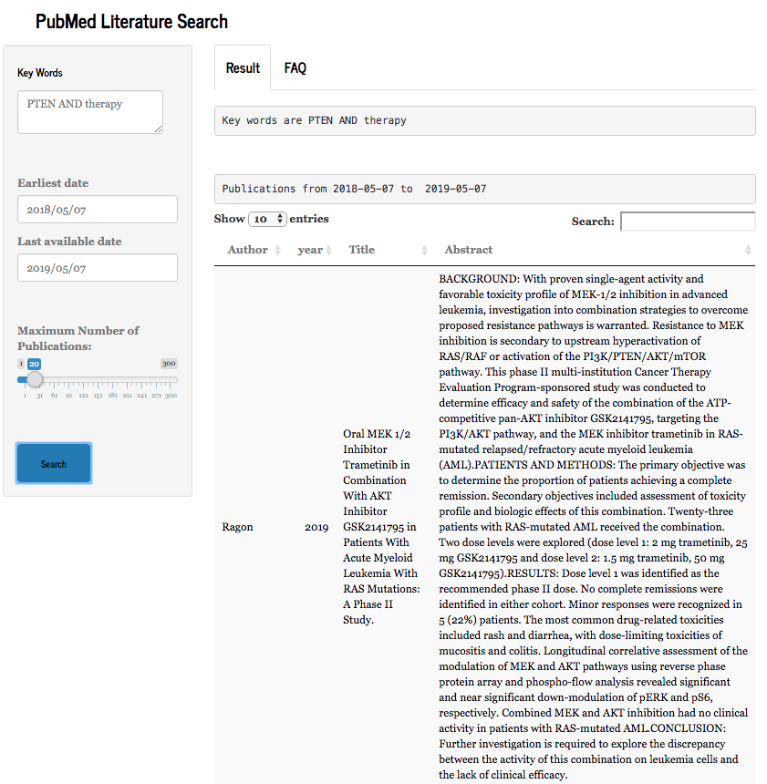

####  [Back](https://dujm.github.io/pages/datascience.html)

## How to download PubMed literature into a csv table in 5 steps?
### I. Try my online app
 * URL: https://duju.shinyapps.io/PubMed-Literature-Search
  

### II. Download PubMed content using RISmed package
#### 1. Install RIS medpackage in R
###### [Documentation](https://cran.r-project.org/web/packages/RISmed/index.html)
    install.packages(RISmed)

#### 2. Define a query
###### Use keywords(e.g. PTEN), database (pubmed), limit of the number of results (e.g. 500)
    library(RISmed)
    res <- EUtilsSummary("PTEN", type="esearch", db="pubmed", retmax=500)

#### 3. Download the results of your query
    EUtilsGet(res,type="efetch",db="pubmed")
    QueryCount(res) # No. of results returned
    summary(res) # Summary of your query

#### 4. Gather information for your output file
    y <- YearPubmed(EUtilsGet(res)) # Year of publication
    t<-ArticleTitle(EUtilsGet(res)) # Title
    a <-AbstractText(EUtilsGet(res)) # Abstract

##### Authors
    at <- Author(EUtilsGet(res))
    at1 <-lapply(at, `[[`, 1) # Extract the first row of each list because I only need the 1st author
    at_first<-lapply(at1, `[[`, 1) # Extract the first element of each row
    at_first_row <- as.data.frame(at_first) # Format as dataframe
    at_first_column <- t(at_first_row)  # Convert row to column using transpose t()  

#### 5. Output to a .csv file     
    myresults <- data.frame('1stAuthor'= at_first_column,'year' = y, 'Title'=t,'Abstract'=a)  
    write.csv(myresults, file = "pubmed_literature.csv",row.names = FALSE)  
